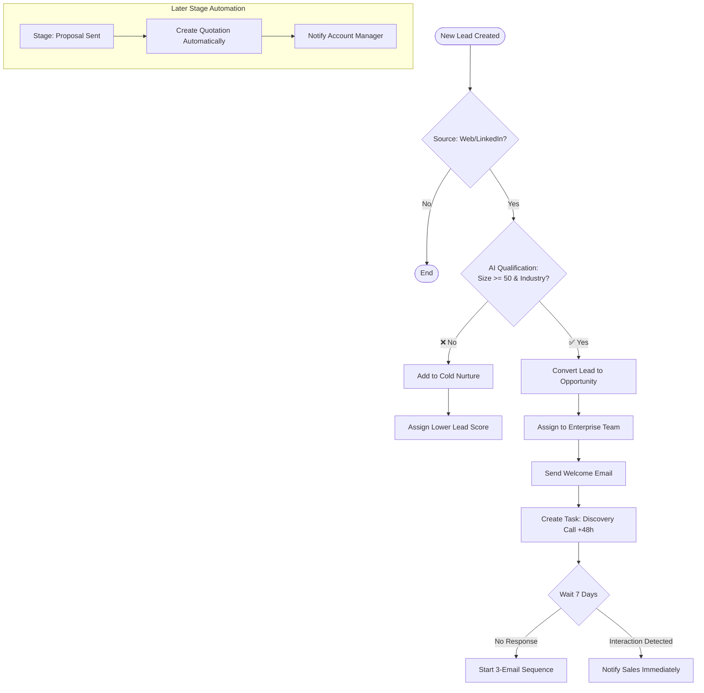

# Odoo CRM Workflow Example  
**Automated Lead Qualification & Nurturing Process**

### 1. Business Process (Plain English)

> Every time a new lead comes in from our website form or LinkedIn campaign, check if the company has more than 50 employees and is in the Technology or Manufacturing industry. If yes, create an opportunity, assign it to the Enterprise Sales team, send a personalized welcome email, and schedule a discovery call task for the assigned salesperson within 48 hours.  
> If the lead doesn't reply within 7 days, send a follow-up sequence (3 emails over 2 weeks). If they open the email or visit the pricing page, notify the salesperson immediately.  
> When the opportunity reaches the "Proposal Sent" stage, create a quote automatically and move it to the Sales module.

---

### 2. Automated Workflow Structure

#### **Trigger**
- **Event**: New Lead Created in Odoo CRM
- **Filters**: Source = Website Form **OR** LinkedIn

---

#### **Decision Node (AI Condition)**
**Condition:**
- Company Size ≥ 50 employees **AND** Industry in [Technology, Manufacturing]

#### **✅ Yes Path – Qualified Lead**

1. Convert Lead → Opportunity
2. Assign Opportunity to **Enterprise Sales Team**
3. Send Welcome Email (using predefined template)
4. Create Task: "Schedule Discovery Call"  
   - Due date: +48 hours  
   - Assigned to Opportunity Owner
5. **Wait** 7 days
6. If no response → Start 3-email nurture sequence (over 2 weeks)
7. **Real-time Monitoring**:
   - Email Opened **OR** Pricing Page Visited → Send instant notification + High Priority Task

#### **❌ No Path – Not Qualified**

- Add to "Cold Nurture" list
- Send monthly newsletter drip campaign
- Assign lower lead score

---

#### **Later Stage Automation**

- **When Opportunity Stage changes to "Proposal Sent"**:
  - Automatically create Quotation in Sales module
  - Notify Account Manager
  - Create follow-up task (+3 days)

---

### 3. Odoo Modules Integrated

| Module              | Usage |
|---------------------|-------|
| **CRM**             | Leads, Opportunities, Stages, Activities |
| **Contacts**        | Company Size, Industry, Tags |
| **Email Marketing** | Automated emails + tracking |
| **Sales**           | Automatic Quotation creation |
| **Calendar**        | Task and meeting creation |
| **Website**         | Form tracking & page visit detection |

---

### 4. Key Benefits

- Reduces manual lead handling time dramatically
- Ensures fast and consistent follow-up
- Sales team focuses only on high-potential leads
- Full audit trail and performance analytics
- Maintainable by non-technical users (Sales Managers)

---

### 5. Ready for AI Workflow Builder

This entire process can be:
- Described in plain English
- Automatically converted into a visual workflow
- Validated for safety & logic
- Deployed into Odoo with one click