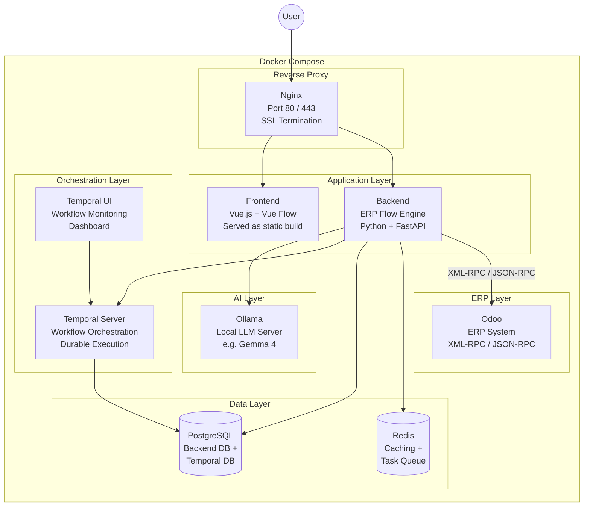

# ERP Flow — Infrastructure Architecture

## Docker Compose Orchestration

All services are containerized and orchestrated via Docker Compose for local development and production deployment.

---

### Infrastructure Diagram



---

### Container Inventory

| Container | Image | Purpose | Port |
|-----------|-------|---------|------|
| **nginx** | `nginx:alpine` | Reverse proxy, SSL termination, route `/` to frontend and `/api` to backend | 80, 443 |
| **frontend** | Custom build | Vue.js + Vue Flow app served as static files | 3000 (internal) |
| **backend** | Custom build | ERP Flow Engine — FastAPI application | 8000 (internal) |
| **ollama** | `ollama/ollama` | Local LLM server for plain English → JSON parsing | 11434 (internal) |
| **temporal** | `temporalio/auto-setup` | Durable workflow orchestration, retries, state management | 7233 (internal) |
| **temporal-ui** | `temporalio/ui` | Web dashboard to monitor workflow executions | 8080 (internal) |
| **postgres** | `postgres:16` | Database for backend state + Temporal persistence | 5432 (internal) |
| **redis** | `redis:alpine` | Caching layer + task queue for the backend | 6379 (internal) |
| **odoo** | `odoo:17` | ERP system (can also be an external Odoo instance) | 8069 (internal) |

---

### Architecture Decisions & Rationale

#### ✅ Nginx — Reverse Proxy
- Routes traffic: `/` → Frontend, `/api` → Backend
- Handles SSL/TLS termination
- Single entry point for the entire application

#### ✅ Temporal.io — Workflow Orchestration (not just monitoring)

> [!IMPORTANT]
> Temporal is **not a monitoring tool** — it is a **durable workflow orchestration engine**.
> It is the right choice here, but for a different reason than monitoring.

**Why Temporal makes sense for ERP Flow:**

| Problem | How Temporal Solves It |
|---------|----------------------|
| Deploying a workflow to Odoo requires 5-10 sequential API calls | If call #4 fails, Temporal retries from that exact step — no need to redo calls #1-3 |
| "Wait 7 days then follow up" needs durable timers | Temporal handles long-running waits natively, even across server restarts |
| Workflow deployment could partially fail | Temporal supports compensation/rollback logic (saga pattern) |
| Need visibility into what happened | Temporal UI shows every workflow execution, step-by-step, with full history |

**Temporal replaces:**
- Custom retry logic in the backend
- Manual state tracking in the database
- Cron jobs for scheduled follow-ups
- Custom error recovery code

#### ✅ PostgreSQL — Shared Database
- Backend needs it for workflow metadata, user data, audit logs
- Temporal requires PostgreSQL (or MySQL) for persistence
- Can use separate databases on the same PostgreSQL instance

#### ✅ Redis — Caching & Queue
- Cache Odoo schema/metadata (avoid repeated API calls)
- Queue background tasks (email notifications, webhook processing)
- Session storage if needed

---

### What Nginx Exposes vs What Stays Internal

```
Internet / User
       │
       ▼
   ┌─────────┐
   │  Nginx   │  :80 / :443  (only public-facing port)
   └────┬─────┘
        │
   ┌────┴──────────────────────────┐
   │         Internal Network       │
   │                                │
   │  Frontend (:3000)              │
   │  Backend  (:8000)              │
   │  Ollama   (:11434)            │
   │  Temporal (:7233)              │
   │  Temporal UI (:8080)           │
   │  PostgreSQL (:5432)            │
   │  Redis (:6379)                 │
   │  Odoo (:8069)                  │
   │                                │
   └────────────────────────────────┘
```

Only Nginx is exposed. All other services communicate on Docker's internal network.

---

### Suggestions for Improvement

1. **Add health checks** to every container in `docker-compose.yml` — ensures dependent services wait for readiness
2. **GPU passthrough for Ollama** — if the host has a GPU, configure `deploy.resources.reservations.devices` in compose
3. **Odoo could be external** — if deploying to a client's existing Odoo instance, remove the Odoo container and point the backend to their server
4. **Volume mounts** — persist PostgreSQL data, Ollama model files, and Odoo filestore
5. **Environment files** — use `.env` for secrets (Odoo credentials, database passwords)
