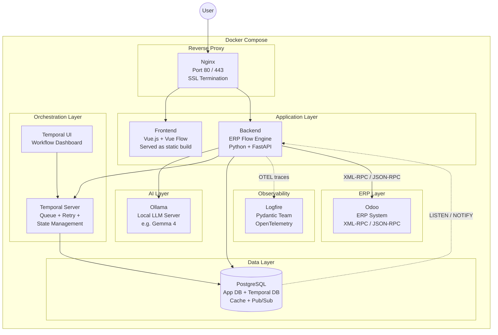

# ERP Flow — Infrastructure Architecture

## Docker Compose Orchestration

All services are containerized and orchestrated via Docker Compose for local development and production deployment.

---

### Infrastructure Diagram



---

### Container Inventory

| Container | Image | Purpose | Port |
|-----------|-------|---------|------|
| **nginx** | `nginx:alpine` | Reverse proxy, SSL termination, route `/` to frontend and `/api` to backend | 80, 443 |
| **frontend** | Custom build | Vue.js + Vue Flow app served as static files | 3000 (internal) |
| **backend** | Custom build | ERP Flow Engine — FastAPI application + Temporal worker | 8000 (internal) |
| **ollama** | `ollama/ollama` | Local LLM server for plain English → JSON parsing | 11434 (internal) |
| **temporal** | `temporalio/auto-setup` | Durable workflow orchestration, queue, retries, state management | 7233 (internal) |
| **temporal-ui** | `temporalio/ui` | Web dashboard to monitor workflow executions | 8080 (internal) |
| **postgres** | `postgres:16` | App database + Temporal persistence + caching + pub/sub | 5432 (internal) |
| **odoo** | `odoo:17` | ERP system (can also be an external Odoo instance) | 8069 (internal) |

> [!NOTE]
> **No Redis needed.** PostgreSQL handles caching and pub/sub natively. Temporal handles queuing and retries.

---

### Architecture Decisions & Rationale

#### ✅ Nginx — Reverse Proxy
- Routes traffic: `/` → Frontend, `/api` → Backend
- Handles SSL/TLS termination
- Single entry point for the entire application

---

#### ✅ Temporal.io — Queue, Retry & State Management

Temporal handles all workflow execution concerns:

| Responsibility | How Temporal Handles It |
|----------------|------------------------|
| **Queue** | Workflows and activities are dispatched to task queues — workers pick them up |
| **Retry** | Built-in retry policies with configurable backoff, max attempts, and timeout |
| **State** | Every workflow step is persisted — survives server restarts and crashes |
| **Saga / Rollback** | If deploying step #4 to Odoo fails, compensate steps #1-3 automatically |
| **Durable Timers** | "Wait 7 days then follow up" — works even if the server restarts |
| **Visibility** | Temporal UI shows every execution, step-by-step, with full event history |

---

#### ✅ PostgreSQL — Database, Cache & Pub/Sub

PostgreSQL serves **three roles**, eliminating the need for Redis:

##### 1. Application Database
- Workflow metadata, user data, audit logs
- Temporal persistence (separate database on same instance)

##### 2. Caching (replaces Redis cache)

Using **unlogged tables** for high-performance caching:

```sql
-- Unlogged tables = no WAL overhead, fast writes, perfect for cache
CREATE UNLOGGED TABLE cache (
    key    TEXT PRIMARY KEY,
    value  JSONB NOT NULL,
    ttl    TIMESTAMPTZ NOT NULL DEFAULT now() + interval '1 hour'
);

-- Example: cache Odoo model schemas to avoid repeated API calls
INSERT INTO cache (key, value)
VALUES ('odoo:crm.lead:fields', '{"name": "char", "email": "char", ...}')
ON CONFLICT (key) DO UPDATE SET value = EXCLUDED.value, ttl = DEFAULT;
```

Alternative: **Materialized views** for pre-computed data (e.g., workflow statistics dashboard).

##### 3. Pub/Sub (replaces Redis pub/sub)

Using PostgreSQL native **LISTEN / NOTIFY**:

```sql
-- Backend publishes when a workflow deployment completes
NOTIFY workflow_events, '{"workflow_id": 42, "status": "deployed"}';

-- Frontend (via WebSocket) or other services listen
LISTEN workflow_events;
```

**Use cases:**
- Notify frontend in real-time when a workflow finishes deploying
- Alert the backend when Odoo triggers arrive via webhook
- Coordinate between Temporal workers and the API server

---

#### ✅ Logfire — Observability & Monitoring

[Logfire](https://logfire.pydantic.dev/) by the Pydantic team provides full observability:

| Feature | Details |
|---------|---------|
| **Auto-instrumentation** | Zero-config for FastAPI — traces every request, DB query, and HTTP call automatically |
| **OpenTelemetry native** | Standard OTEL protocol — no vendor lock-in |
| **Python-first** | Deep integration with Pydantic models, SQLAlchemy, httpx |
| **Tracing** | End-to-end request tracing across Backend → Ollama → Odoo API calls |
| **Logging** | Structured logs with trace correlation |
| **Metrics** | Request latency, error rates, Odoo API response times |
| **Dashboard** | Web UI for live monitoring and historical analysis |

**Integration is minimal** — one line in FastAPI:

```python
import logfire

logfire.configure()
logfire.instrument_fastapi(app)
logfire.instrument_httpx()  # traces Odoo API calls
logfire.instrument_psycopg()  # traces DB queries
```

---

### What Nginx Exposes vs What Stays Internal

```
Internet / User
       │
       ▼
   ┌─────────┐
   │  Nginx   │  :80 / :443  (only public-facing port)
   └────┬─────┘
        │
   ┌────┴──────────────────────────┐
   │         Internal Network       │
   │                                │
   │  Frontend (:3000)              │
   │  Backend  (:8000)              │
   │  Ollama   (:11434)            │
   │  Temporal (:7233)              │
   │  Temporal UI (:8080)           │
   │  PostgreSQL (:5432)            │
   │  Odoo (:8069)                  │
   │                                │
   │  Logfire ── cloud-hosted ──→   │
   │  (OTEL traces sent outbound)   │
   │                                │
   └────────────────────────────────┘
```

Only Nginx is exposed. All other services communicate on Docker's internal network.
Logfire is a cloud service — traces are sent outbound via OTEL protocol.

---

### Responsibility Matrix

| Concern | Tool | Why Not Alternatives |
|---------|------|---------------------|
| **Caching** | PostgreSQL (unlogged tables) | No Redis needed — one less container, simpler ops |
| **Pub/Sub** | PostgreSQL (LISTEN/NOTIFY) | Lightweight, built-in, no message broker needed |
| **Queue** | Temporal.io (task queues) | More powerful than Celery/RQ — durable, resumable |
| **Retry** | Temporal.io (retry policies) | Built-in backoff, max attempts, non-retryable errors |
| **State** | Temporal.io (event sourcing) | Every step persisted — survives crashes |
| **Monitoring** | Logfire (OpenTelemetry) | Native FastAPI/Pydantic support — zero config |
| **Reverse Proxy** | Nginx | Industry standard, SSL, rate limiting |
| **AI** | Ollama (local) | Privacy, no API costs, full control |

---

### Suggestions

1. **Health checks** — add to every container in `docker-compose.yml` to ensure dependency ordering
2. **GPU passthrough for Ollama** — configure `deploy.resources.reservations.devices` if host has a GPU
3. **Odoo could be external** — if deploying to a client's existing Odoo instance, remove the Odoo container
4. **Volume mounts** — persist PostgreSQL data, Ollama model files, and Odoo filestore
5. **Environment files** — use `.env` for secrets (Odoo credentials, database passwords, Logfire token)
