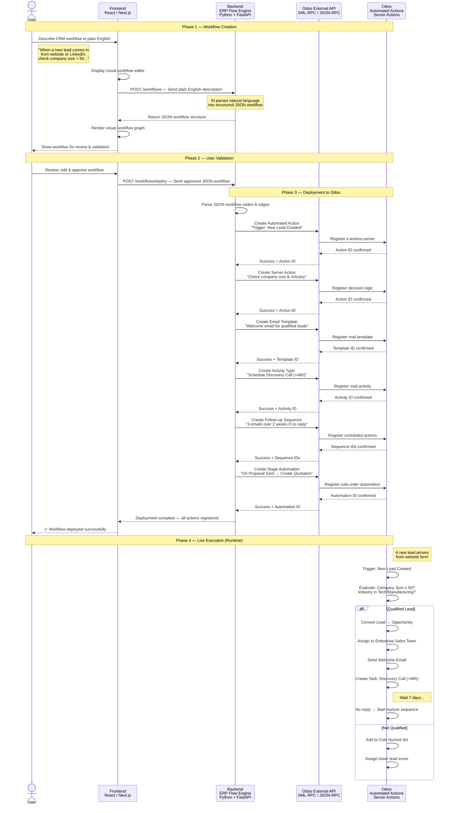

# ERP Flow — Sequence Diagram

## Data Flow: From Plain English to Odoo Automation

This diagram shows the end-to-end data flow when a user describes a CRM workflow in plain English, and the system deploys it as live automation in Odoo.

---

### Full Sequence Diagram

---

### System Components

| Component | Role | Technology |
|-----------|------|------------|
| **Frontend** | User interface for workflow description, visual editing, and monitoring | React / Next.js |
| **Backend (ERP Flow Engine)** | AI parsing, JSON workflow generation, deployment orchestration | Python + FastAPI |
| **Odoo External API** | Bridge between the engine and Odoo's internal models | XML-RPC / JSON-RPC |
| **Odoo Automated Actions** | Live execution of deployed workflows inside Odoo | ir.actions.server, mail.template, mail.activity |
